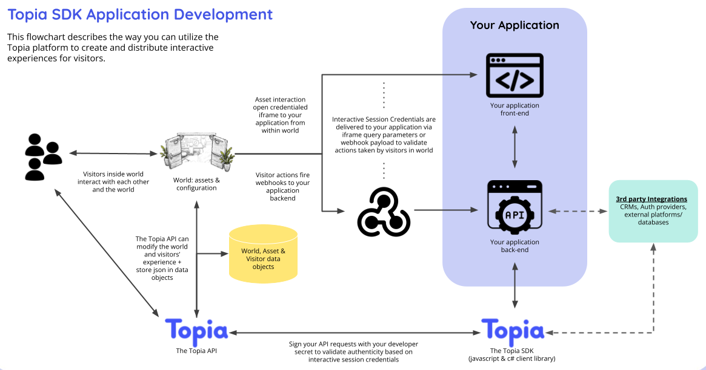

# Javascript RTSDK - Topia Client Library

The Topia Client Library leverages the Topia Public API and allows users to interact with the topia systems and modify their world programmatically. With the SDK you can now build new features to be used in Topia! Check out a few awesome examples [here](https://sdk-examples.metaversecloud.com/).

<br>

## Authorization

A Topia provided API Key can be included with every object initialization as a parameter named `apiKey`. This API Key is used to in authorization headers in all calls to the Public API.

### Want to build interactive assets? This is how you can get started:

- Email developers@metaversecloud.com and Topia wil send you a Public/Private key pair.
- When you want to make an asset “interactive” add your PUBLIC key to the integrations page of the asset editor. Now webhooks that fire from this asset and iframes that open from this asset include the following values:
  - assetId
  - interactivePublicKey
  - interactiveNonce
  - visitorId
  - urlSlug
- The above values are included in the query params of the iframe URL as well as payload of the webhook.
- Once you have the above values you can pass them as credentials into the factory classes when creating class instances.

```ts
await DroppedAsset.get(assetId, urlSlug, {
  credentials: {
    assetId,
    interactivePublicKey,
    interactiveNonce,
    visitorId,
    urlSlug,
  },
});
```

<br />

### Need an API Key to test locally? This is how you can create one:

- While logged in to [topia.io](https://topia.io/), click on your image (or gray circle) in the top left of the screen to open My Account
- In the side menu, select Integrations
- Click Generate New API Key and copy the API Key to be used in your .env and while using https://sdk-examples.metaversecloud.com

<br>

Alternatively, visitors of a [topia.io](https://topia.io/) world interact with each other and the interactively configured assets in your world without the need for an API Key. This is all made possible through Interactive Session credentials passed to the SDK with every request, when applicable. What does this mean for you? Not much, actually! All of the magic happens behind the scenes and all you have to do is make sure that new class constructors include an options object like this: `options: WorldOptionalInterface = { attributes: {}, credentials: {} }` and all calls to `this.topia.axios` include the inherited `this.requestOptions` parameter.



<br>

<hr/>

# Developers

Need inspiration?! Check out our [example application](https://sdk-examples.metaversecloud.com/) which utilizes the SDK to create new and enhanced features inside [topia.io](https://topia.io/).

<br>

## Get Started

Run `yarn add @rtsdk/topia` or `npm install @rtsdk/topia`

Create your instance of Topia and instantiate the factories you need:

```js
dotenv.config();
import dotenv from "dotenv";

import { AssetFactory, Topia, DroppedAssetFactory, UserFactory, WorldFactory } from "@rtsdk/topia";

const config = {
  apiDomain: process.env.INSTANCE_DOMAIN || "https://api.topia.io/",
  apiKey: process.env.API_KEY,
  interactiveKey: process.env.INTERACTIVE_KEY,
  interactiveSecret: process.env.INTERACTIVE_SECRET,
};

const myTopiaInstance = new Topia(config);

const Asset = new AssetFactory(myTopiaInstance);
const DroppedAsset = new DroppedAssetFactory(myTopiaInstance);
const User = new UserFactory(myTopiaInstance);
const World = new WorldFactory(myTopiaInstance);

export { Asset, DroppedAsset, myTopiaInstance, User, World };
```

<br/>

Put it to use:

```js
import { DroppedAsset } from "./pathToAboveCode";

export const getAssetAndDataObject = async (req) => {
  const { assetId, urlSlug } = req.body;

  const droppedAsset = await DroppedAsset.get(assetId, urlSlug, {
    credentials: req.body,
  });

  await droppedAsset.fetchDroppedAssetDataObject();
  return droppedAsset;
};
```

<hr/>

# Contributors

## Get Started

Run `gh repo clone metaversecloud-com/mc-sdk-js`

<br>

## Issues

We've added an Issue template to help standardize Issues and ensure they have enough detail for a developer to start work and help prevent contributors from forgetting to add an important piece of information.

<br>

## Pull Requests

We've added a Pull Request template to help make it easier for developers to clarify what the proposed changes will do. This helps facilitate clear communication between all contributors of the SDK and ensures that we are all on the same page!

<br>

## Documentation

We use [TypeDoc](https://typedoc.org/guides/overview) to convert comments in TypeScript source code into rendered HTML documentation. Comments should be simple and concise and include examples where applicable. Please be sure to add or update comments accordingly!

To update docs run `yarn docs`.

To view docs locally open `mc-sdk-js/clients/client-topia/docs/modules.html` in your browser.

Example of Class comments:

````ts
/**
 * @summary
 * Create an instance of Dropped Asset class with a given dropped asset id, url slug, and optional attributes and session credentials.
 *
 * @usage
 * ```ts
 * await new DroppedAsset(topia, "1giFZb0sQ3X27L7uGyQX", "example", { attributes: { text: "" }, credentials: { assetId: "1giFZb0sQ3X27L7uGyQX" } } });
 * ```
 */
````

Example of method comments

````ts
/**
 * @summary
 * Sets the data object for a dropped asset.
 *
 * Optionally, a lock can be provided with this request to ensure only one update happens at a time between all updates that share the same lock id
 *
 * @usage
 * ```ts
 * await droppedAsset.setDroppedAssetDataObject({
 *   "exampleKey": "exampleValue",
 * });
 * const { dataObject } = droppedAsset;
 * ```
 */
````

<br>

## Testing

We use Jest for testing and take advantage of dependency injection to pass mock data into our services.

To run the test suite, please run `yarn test`.

<br><br>
